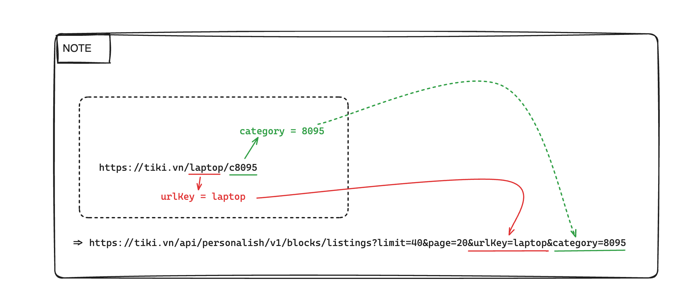
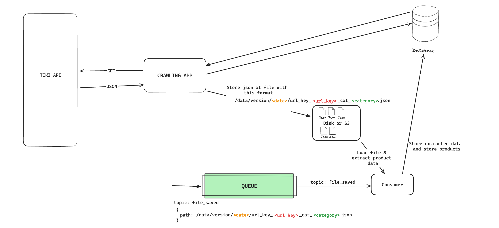

## About this project

This product uses latest Laravel version to build a crawler.
This crawler will crawl the data from the data source(https://tiki.vn/laptop/c8095)

## Stack:
- Backend: 
  - PHP(Laravel)
  - MYSQL
  - Redis
- Frontend:
  - Breeze and Vue <- Breeze Laravel
    

## Setup
In this project, we will use docker for the development process. In particular, Laravel has a package that helps us to easily manage and set it up. And it's name is [Sail](https://laravel.com/docs/10.x/sail).
- Install docker
- Copy .env.example to .env and start filling in the values.
  ```shell
    cp .env.example .env
    ```
- Run below commands:
  ```shell
    docker-compose up -d
    docker-compose run laravel.test composer install
    ./vendor/bin/sail up --build
    ./vendor/bin/sail php artisan key:generate
    ./vendor/bin/sail npm install
    ./vendor/bin/sail npm run build
    ./vendor/bin/sail php artisan pub-sub:file-saved-subscriber
    ```
- Open new terminal and run this command:
  ```shell
    ./vendor/bin/sail php artisan tiki:crawl https://tiki.vn/laptop/c8095
    ```

## Solution Diagram



In this solution, we need 2 long processes run.
- 1 Subscriber
    ```shell
    ./vendor/bin/sail php artisan pub-sub:file-saved-subscriber
    ```
- 1 Publisher
   ```shell
    ./vendor/bin/sail php artisan tiki:crawl https://tiki.vn/laptop/c8095
    ```
## Result Screenshot


### Route List
```text
  POST      api/cart .......................... CartController@createEmptyCart
  GET|HEAD  api/cart/{maskedId} ........................... CartController@get
  POST      api/cart/{maskedId} ...................... CartController@addItems
  GET|HEAD  api/products ............................ ProductController@search
```

### Reference sources
- **[Laravel 10.x](https://laravel.com/)**
- **[Vite](https://vitejs.dev/)**
- **[Breeze and React / Vue](https://laravel.com/docs/10.x/starter-kits#breeze-and-inertia)**
- **[Pinia](https://pinia.vuejs.org/)**


## Contact
- Fullname: Dang Nghia
- Email: dangnghia25197@gmail.com
- LinkedIn: https://www.linkedin.com/in/dangnghia
